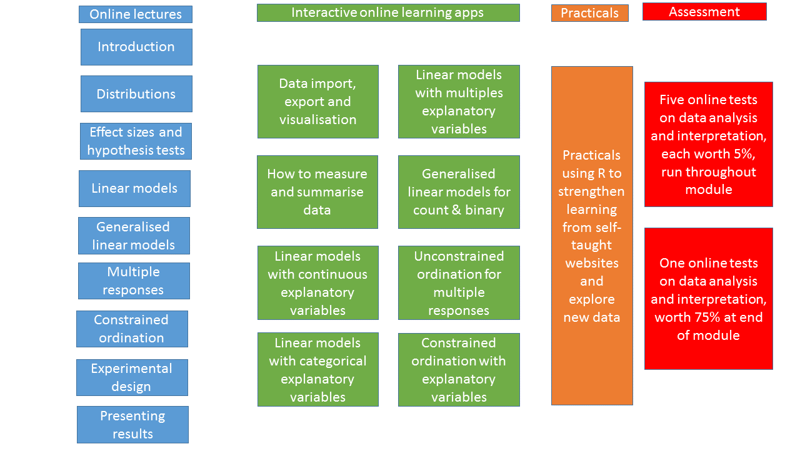

```{r setup, include=FALSE}
knitr::opts_chunk$set(echo = TRUE)
```

<style type="text/css">
span.boxed {
  border:5px solid gray;
  border-radius:10px;
  padding: 5px;
}
span.invboxed {
  border:5px solid gray;
  padding: 5px;
  border-radius:10px;
  color: white;
}
table, td, th
{
border:0px;
}
</style>


# Introduction
This document provides you with the aims and rationale behind the course, explains its mode of delivery given the 'flexible learning' setup for Semester 1, staff roles, and forms of assessment. 
More importantly, it explains the underlying philosophy used to teach experimental design and statistics, which will probably differ from most that you may have previously encountered, or seen in textbooks. 
A common approach is to provide students with a plethora of different statistical tests that they may or may not need to apply to their data, depending on how they collected their data, the aims and objectives of their experiment etc. 
This can be very confusing, resulting in bafflement (that was my experience as an undergraduate) with the result that some UG textbooks provide complex flowcharts to help students select the appropriate test.

A second challenge is the type of software used to undertake statistics. 
I am (just) old enough to remember doing some basic statistical tests with a calculator which would take a whole afternoon, even with a relatively small sample size. 
The arrival of computers to take the tedium out of this was a great relief. 
Most software commonly used for statistics, such as Microsoft Excel, Minitab and SPSS are menu-driven, making it easy to get started with data analysis and graph display. 
However, whilst their learning curve is initially very shallow, it soon becomes steep. 
Biological data is inherently complex, and often the more advanced analyses or data visualisations are difficult or impossible to undertake. 
An additional problem is that you have no record of what you have done. You will be taking this course in October to December 2020, but many of the skills you will learn will not be practiced in full until you are doing Stage 3 courses and projects. 
If you have not looked at Minitab after completing this course, will you remember which menu options to click on in January 2022 ? Therefore, we need an approach to teaching that provides you with a long-term, easy to read record of both why and what analyses you have undertaken in this course, and that has guided our choice of software.

Finally, this is the first year in which I have taught on this course, and it has had to be substantially re-written for Newcastle University's flexible learning system. 
A student representative for each course will be able to provide feedback to staff, to hear what needs improving, and also what you like.

# Introduction to Biostatistical Modelling
To some extent the above heading would be a better title for this course than "Experimental Design and Statistics". 
Some of you, especially those focussed on cell and molecular biology and / or working in the laboratories are likely to be conducting formal experiments. 
Others, especially those collecting ecological / environmental data, might be undertaking more survey-work, but this will still be formalised such that it can be analysed and inferences drawn. 
There are a wide range of experimental and survey designs available, but what they all have in common is the aim to **separate the signal from the noise**. 
By "signal" we are talking about questions such as 'Does this antibiotic kill MRSA bacteria?" or "Does low-fertiliser input result in more insect species?" etc. 
In other words, the biological question that you really want to address and answer.

Biological data are inherently noisy: if you repeat the same experiment twice you will obtain similar, but not identical results. 
Some biological systems, such as ecological ones, are noisier than laboratory ones, but even in the latter sample contamination, temperature variations etc. will result in slightly different results.
All good experimental / survey designs have the aim of allowing you to work out where the noise in your system is coming from. 
If you can reduce, or understand, the noise you are more likely to be able to look at the signal which is what you are really interested in.

## Cause and effect
When you undertake an experiment or survey, you will often be interested in knowing what effect a particular treatment, management regime etc. has on an outcome. For example:

* Is bird Shannon diversity affected by willow coppice management?
* How long should people self-isolate for if tested positive for Covid19?
* Is % photosynthetic efficiency affected by iron availability in the soil?
* Is wheat yield increased by both Azole and SDHI fungicides at different doses?
* What dose of insecticide kills 50% of the aphids?

For some of these questions it is easy to see how you might design an experiment or survey to answer your question, whereas for others it is harder. 
What they all haven in common is an underlying assumption about cause and effect, which are often referred to as **independent** and **dependent** variables, or **explanatory** and **response** variables. 
So for the above examples, we can view them as:

| Response | Explanatory |
|:---------:|:-----------:|
| Bird diversity | Coppice management occurs (yes/no) |
| Isolation time (days) | Covid test (positive / negative) |
| Photosynthesis (%) | Fe concentration (mg/l) |
| Wheat yield (t/ha) | Azole (none / low / high) and SDHI (none / low / high) |
| Aphids (dead/alive) | Insecticide dose (mg/l) |

In some of these examples your response (dependent) variable is continuous, with numbers that contain decimal points (bird diversity, wheat yield), in some the response is a whole number (3 days isolation, 7 days, 12 days etc.), and others a value between 0 and 100 (% peak photosynthesis). 
Likewise sometimes the explanatory (independent) variables have two categories (coppice, covid test), some multiple categories (Azole and SDHI) whilst others are continuous (Fe concentration). 
Three of the examples (bird, isolation and photosynthesis) only have one explanatory variable, whereas the fourth (wheat) has two explanatory variables. 
In the last example, the response variable is binary (dead or alive aphids).

Irrespective of the exact type of data, all the above examples have the same pattern of:

$$\text{Response variable = Explanatory variable(s)}$$
in other words we are trying to determine whether the explanatory variable(s) are or are not changing the response variable. 
However, we have already stated that biological data is noisy, and the noisier the data the harder it becomes to determine cause and effect. Therefore, we need to expand our previous equation to:

$$\text{Response variable = Explanatory variable(s) + Noise}$$
We don't know what causes this noise, although we can often have a good guess. 
In this course we will consider simple experimental designs that help explain some of the noise, allowing you to focus more on what your explanatory variables are doing. 
This noise is more usually referred to as "Residual Error" or simply "Error" : this is not to imply that you have done something wrong, merely that we do not know where the variation has come from, and we need to account for it.

The majority of the statistical models that we create in this course will have this syntax of a response variable and one or more explanatory variables, with residual error that is quantified.
Formally, this can be written as:

$$Y = X + \epsilon$$

where 

* $Y$ is your response variable
* $X$ is one or more explanatory variables
* $\epsilon$ is the Greek letter Epsilon, which by convention is used to represent the 'noise' or 'residual error' or 'variability' in your data.

## Correlation does not indicate causation
It is very easy to be seduced by statistics, and show a nice pattern between different variables that suggests something is happening when in reality it is not. 
For example, the number of diagnosed brain tumours in different States in the USA is strongly correlated with the number of mobile phone users in each State. 
Does that imply that you should throw your Android and iPhones in the bin? No.
Think about it for a moment: what matters is the number of brain tumours per capita. 
Once you take the size of the population of each State into account the correlation disappears. No need to panic!

This is a trivial example, but I include it simply to emphasise that you are first and foremost biologists. 
You must always ask whether the question you are asking makes biological sense, and not blindly accept some numbers generated by a computer.

# Defining goals
One approach we will try and use as much as possible is to think in terms of the **goal** that you are trying to score. By a goal, we could be referring to a particular graph or plot to visualise your data, a way of tabulating a summary of your data, or undertaking a statistical model. Broadly, your thinking can be along the lines of:

&nbsp;

<center>
<h2><strong><span class="boxed">goal</span> ( <span class="boxed">y</span> ~ <span class="boxed">x</span> , data = <span class="boxed">mydata</span>, ... )</strong> 
</h2></center>

&nbsp;

Let's decode this little diagram:

* **goal** This can be a plot, such as a barchart, scatterplot, boxplot etc. It could be a statistical test, it might be a simple summary statistic, for example an average (`mean`), or standard deviation (`sd`), or it might be a statistical model, such as a linear model (`lm`) or generalised linear model (`glm`). All these will be introduced to you during the course.
* **y ~ x** This represents the $Y = X$ in the equation earlier.  For some graphs or simple statistics you might only need the $Y$ component. For example, if you the average overall bird diversity across all your sites, you would just provide the $Y$ data of bird diversity at each wood. If you want the average broken down for both coppiced and uncoppiced woodlands, you would provide both the $Y$ and $X$ data. Note that you do not actually need to put $+ \epsilon$ as this is calculated for you where needed.
* **data = mydata** Obviously you will be working with data. Often you need to *pre-process* your data before you can achieve your goal, and we will teach you simple tricks to do this.
* **...** This represents additional options. For graphs, you might want to change colours, titles etc. In statistical models, some assumptions may need to be changed when you work with deal with count data (e.g. days after Covid19), bounded data (e.g. % photosynthesis efficiency), or presence / absence data (e.g. dead or alive aphids).

# Course structure
Most teaching will be done remotely and there are no immediate plans for 'Present in Person' teaching although this may change. 
As a large cohort of students (170) take the module it is difficult to obtain lecture theatre space under the current restrictions. 
There will be lectures, practicals, in-course assessments, plus trained demonstrators to assist you. 
There will be synchronous sessions where you will be able to receive help directly from staff and demonstrators, including screen-sharing if you find this useful.

We will provide extensive use of interactive websites we have created for this course, for you to learn and practice ideas before the practicals.
**You should try and work through these websites before attempting the practicals**. 
These websites include simple quizzes to test your understanding. 
In the practicals you will be able to explore the example data shown on the websites in more depth, and hone your skills using new data.

The following diagram summarises the overall course structure


Lectures will be presented primarily be staff from the School of Maths & Statistics; all other teaching will be from staff in the Modelling Evidence and Policy Research Group (MEP) <https://www.ncl.ac.uk/nes/research/biology/modelling-evidence-policy/#ourresearch> within SNES. 
The online tests will be hosted on the new Canvas Virtual Learning Environment, but will require you to analyse and interpret data separately. 
The tests will take the form of short-answer / multiple choice / numeric answers.

## Detailed structure of this course
Materials are all provided on Canvas in the following sections (Canvas 'modules'). 
Each contains a set of recorded lectures / presentations, interactive websites, a related practical, and five include an online Canvas test.
You will not be able to access the practicals (or tests) until you have reviewed the interactive websites.

### Section One - Summarising and displaying data
This will cover simple statistics, including measures of central tendency and variation in your data.

* Statistical power and hypothesis tests will be covered. 
* How do you know if two treatments are different? 
* How do you know if one variable is correlated with an other? 
* What are p-values, what are their uses, and their abuses. 
* What are effect sizes?

This section will also provide guidance on good methods to visualise your data. 
Data visualisation is essential both prior to data analysis, as well as to communicate your results.

#### Lectures
Introductory lecture to module from Roy Sanderson (Natural & Environmental Science)

Lectures from Cristiano Villa (Maths and Stats)

#### Interactive websites
[Data summaries and visualisation](https://naturalandenvironmentalscience.shinyapps.io/Summary_vis/)

[Understanding measures of central tendancy and variation](https://naturalandenvironmentalscience.shinyapps.io/variation/)

#### Practical
Practice examples from interactive webistes

### Section Two - Linear models and ANOVA
Learn about the concept of linear models, the R `lm` and `anova` functions, and how to interpret them. 
Understand the assumptions behind linear models, and look at examples where the explanatory variables are continuous or categorical.

#### Lectures
Lectures from Cristiano Villa (Maths and Stats)

#### Interactive websites
[Linear models with continuous explanatory variables](https://naturalandenvironmentalscience.shinyapps.io/linear_explan/)

[Linear models with categorical explanatory variables](https://naturalandenvironmentalscience.shinyapps.io/categorical_explan/)

#### Practical
Practice examples from interactive webistes

#### First online assessment (5%)
Online Canvas assessment (Opens Friday 30th October, Closes Friday 6th November)

### Section Three - Dealing with multiple explanatory variables
This section explores situations where you might have multiple explanatory variables. 
These might not be independent in their effects, so we explore interactions between them, and how to understand them. 
We also consider ways in which you can improve your experimental design by blocking, and look at what to do if things go wrong and you lose some data. 
We also consider how ANOVA operates - what are the basic concepts of an ANOVA table, and how are we able to study treatment effects by looking at variances?

#### Lectures
Lectures from Cristiano Villa (Maths and Stats)

#### Interactive websites
[Multiple explanatory variables, interactions, blocks and missing data](https://naturalandenvironmentalscience.shinyapps.io/multiple_explan/)

[Understanding how sums of squares are used in linear models](https://naturalandenvironmentalscience.shinyapps.io/how_anova_works/)

#### Practical
Practice examples from interactive webistes

#### Second online assessment (5%)
Online Canvas assessment (Opens Friday 6th November, Closes Friday 13th November)

### Section Four - Generalised linear models
The assumptions behind linear models, accessed through the `lm()` function in R, are breached when our response data consists of counts, proportions, or yes / no, true / false, dead / alive. 
We can extend linear models by generalising them using the `glm()` function. 
This sections shows you the two key statistical distributions relevant to these types of data, the Poisson and Binomial distributions, and how they relate the the traditional Gaussian (normal) distribution used in linear models.

#### Lectures
Lectures from Cristiano Villa (Maths and Stats)

#### Interactive website
[Generalised linear models](https://naturalandenvironmentalscience.shinyapps.io/generalised_linear_models/)

#### Practical
Practice examples from interactive webistes

#### Third online assessment (5%)
Online Canvas assessment (Opens Monday 23rd November, Closes Monday 30th November)

### Section Five - Multiple response data; unconstrained ordination
Sometimes you will not have a single response measurement, but might have 10, 20, 50, or hundreds. 
If you are dealing with genomic or bioinformatic data, you might have thousands of gene sequences that you want to understand. 
If you do surveys of plants, birds or insects you may have large numbers of species. 
It is not correct to do hundreds of separate (g)lms on these data, but multivariate techniques (MVT) provide an effective way to help you interpret them. 
In this section we introduce you to unconstrained ordination, which allows you to visualise relationships amongst your data. 
You can also make simple comparisons with potential explanatory variables.

#### Lectures
Lectures from Cristiano Villa (Maths and Stats)

#### Interactive website
[Unconstrained ordination](https://naturalandenvironmentalscience.shinyapps.io/Unconstrained/)

#### Practical
Practice examples from interactive webistes

#### Fourth online assessment (5%)
Online Canvas assessment (Opens Monday 30th November, Closes Monday 7th December)

### Section Six - Multiple response data; constrained ordination
Here we demonstrate more advanced methods of using your explanatory data when you are working with multiple response variables. 
You will learn about permutation tests, which allow you to 'simulate' conventional ANOVA tests, such that you can infer the importance of your explanatory variables. 
We also discuss the best ways of visualising the results of these analyses.

#### Lectures
Lectures from Cristiano Villa (Maths and Stats)

Lecture from Roy Sanderson (SNES) advice on report-writing, planning research projects in Stage 3 etc.

#### Interactive website
[Constrained ordination](https://naturalandenvironmentalscience.shinyapps.io/Constrained/)

#### Practical
Practice examples from interactive websites

#### Fifth online assessment (5%)
Online Canvas assessment (Opens Monday 7th December, Closes Monday 14th December)

### Appendix
Other tests, such as t.tests, paired t.tests, rank-based tests, Chi-squared tests.
How do they fit into the (generalised) linear model framework. Comparison of the
standard (base) R commands and the equivalent via `lm()` or `glm()`

#### Interactive website
[Appendix - other tests](https://naturalandenvironmentalscience.shinyapps.io/Other_tests/)

### Final online assessment (75%)
This will be delivered through Canvas, and will be of a similar structure to the five short assessments, but covering topics across the whole course, to test your skills and understanding.

Opens Monday 14th December 2020; Closes Friday 15th January 2021.

# Software required
You will use free software called R in this course. 
R was originally designed as a free version as a purely statistical commercial package (called S), and over the last 20 years has become the most popular analytical modelling software used by biologists in academia and industry.
A huge number of free online training resources are available, and people have written what are known as 'packages' to provide extra functionality. 
These include data analysis in bioinformatics, ecology, zoology, animal tracking, genomics etc. 
I have written a small R package (called `bio2020`) to aid teaching on this module.

The R software can be used on your own PC (it is compatible with Windows, Mac OS X and Linux), or you can use the Newcastle University Windows Virtual Desktop (WVD) which simply requires access to a browser or the WVD client <https://services.ncl.ac.uk/itservice/core-services/software/wvd/#accesswvd>. 
We will assume that most students will use WVD, although it can be slow to start, and relies on an internet connection, so it is not a problem if you want to work on your local laptop or PC.
Note that R is not compatible with the Android tablets you were given last year, although there is a WVD client for Android. 
You can download the R software from <https://cran.r-project.org/> by selecting your operating system and downloading the latest release.

<!-- Add in some images here screenshots of step by step install -->

The two main ways of running R software are through the default client, or a more complex (supposedly more user-friendly) system called RStudio Desktop. 
Either method requires you to have the standard R software installed which comes with the default client: <https://cran.r-project.org/>. If you want to install RStudio Desktop you can install it from <https://rstudio.com/products/rstudio/>. 
Some staff and students prefer the simpler default client, others prefer RStudio Desktop. It is not a problem which one you choose.

# What is the question?
As you progress through the rest of Stage 2, and especially in Stage 3, you will find that you are designing more experiments and surveys yourself, rather than being given a laboratory manual or field guide to follow. 
This, of course, is what real scientific research is like: there isn't an absent-minded academic stood nearby to tell you exactly what to do.
You need to be able to deconstruct what you plan to do, in order to create a sensible, practical experiment or survey, that provide data of sufficient quality for you to interpret.

When Stage 3 students approach me wanting to do a research project under my supervision, a common starting point is them saying something along the lines of "I want to do a research project on butterflies", or "I'm interested in pollinator conservation", or "I want to follow a career in mammal conservation". 
These might be valid statements, but my immediate response is to ask "What is the question?", in other words, "What is it specifically that you want to determine?". 
So, taking those examples, it would be better to have something along the lines of:

* Are the numbers of butterflies higher in roadside verges where the vegetation is cut monthly compared to once per year?
* Do bumblebees occur more frequently near fields of mass-flowering crops such as oilseed rape?
* Is the frequency of small mammals detected in camera traps associated with supplementary feed for game birds?

It is only when the students' initial statements are re-phrased into questions that we can start to sketch out possible routes by which you can develop formal scientific hypotheses to test with your statistical model, develop a sampling strategy, do the experiment / survey etc.
Another common mistake is to **confuse aims and objectives**. 
The three bullet points above are still quite general, and might be considered as overall aims. Objectives are much more specific, and might encompass pilot studies to test methodology, or detailed studies of other variables. 
For example, in the butterfly study, two obvious objectives might be to see if the numbers of species of plants or the numbers of flowers $m^2$differed according to cutting regime.

Therefore, when planning your research, a good strategy is to:

* Scope subject area, including literature review
* Define overall aim and the hypothesis / hypotheses you want to test
* Define specific objectives
* Pilot study (ideally) or use literature. This is useful to give you an understanding of the 'effect size' (more later) you are trying to detect, and thus the numbers or frequency of replicate samples that might be needed
* Design your experiment or survey. You might be able to use 'block' techniques to reduce the error ($\epsilon$) in your data
* Undertake your experiment or survey, keeping careful laboratory or field records.
* Enter your data into a computer (often Excel, but if using maps specialist GIS software may be better).
* Pre-process your data. This **always** takes longer than you expect. Sometimes you make typing errors when entering your raw data, you may need to 'reshape' or 'wrangle' it so that it is suitable for analysis.
It is worth thinking about how you plan to analyse your data as early as possible, **before** you undertake any data collection, so that the time spent on pre-processing is minimised. 
Pre-processing can be done in Excel or R and whole books have been written on the subject, but it will not be a major focus of this course.
* Save your data from Excel into a plain text format that can be easily imported into R. You can use the Save As option to save your data in comma separated format (CSV) which is widely used.
* Import your data into R and create summary tables, charts, figures. This is quite an important step, as it helps you spot broad patterns, as well as possible data errors and outliers
* Statistical model of your data.
* Check assumptions of your model. All statistical models make certain assumptions about the input data, and if your data breach these you may have to change to type of model, or even do a simple log or square-root transformation of data
* Interpret model; if necessary modify and re-run different models and compare them. In general, the **simpler your model the better**. It is easy to create quite complex statistical models that reduce the error ($\epsilon$) but these risk being difficult to interpret. Simple models are often more biologically meaningful. Never expect to produce a 'perfect' model, as all models are approximations of reality.
* Write up your report (see tips below)

# The last part of any quantitative modelling
Depending on your preferences, this is either the easiest part, or the most difficult! 
Analysing and interpretating your data is not the whole story: you have to write it up as a report. 
Personally, I often find this the most difficult step, as I easily get writer's block, especially if I start up Microsoft Word, type in the word **Introduction** and look at a blank, white screen. 
Most reports you will write on this and other courses, especially Stage 3, and for your Stage 3 project, will probably follow the format of

* Abstract
* Introduction
* Methods
* Results
* Discussion
* References

That might be how it is written, but the order I often find myself writing scientific papers is along the lines of:

1. Methods (I know what I did, so this is easy to write. Phew! One section written...)

2. Results (I know what I've obtained from my analyses, and have created various graphs and tables to support them. Making progress, two sections written...)

3. Discussion (now I can go ahead and interpret my results in the context of existing scientific literature, discuss where it accords or contrasts with previous research, and explore possibilities for further research...)

4. Introduction (given that the rest has now been written, this is much easier to write as I know what I'm about to introduce.)

5. References (of course, before you even begin your experiments / surveys, you need to have a good knowledge of the literature. I recommend you also use bibliographic software, such as [Zotero](www.zotero.org), which automatically creates references for you)

6. Abstract (a good abstract is suprisingly difficult to write. It needs to be concise, precises, and quickly communicate your findings. A good title is of course also essential.)

Many scientists use the "hourglass" model as a way of thinking about how to structure scientific papers which you may have come across in Stage 1:


I also particularly recommend you look at [this post](https://dynamicecology.wordpress.com/2016/02/24/the-5-pivotal-paragraphs-in-a-paper/) which describes the **5 key paragraphs of any scientific paper**. 
It is written by an ecologist, but is actually applicable to any discipline. 
The same site also provides [some useful tricks for clear writing](https://dynamicecology.wordpress.com/2012/11/14/clear-writing/).

